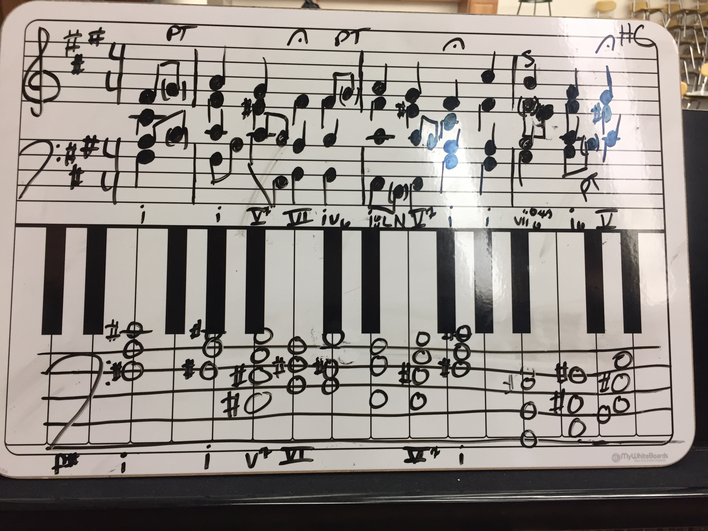

## AP Theory

A guide for Advanced Placement Music Theory class! Contains Topic Overviews and graded practice Quizzes to help you succeed on the AP Music Theory Exam. 

### A live link to the project is available here: (https://ap-theory.now.sh)

## Stack:
* Client: React
* Web Server: Node and Express with PostgreSQL 
* Database: PostgreSQL hosted on Heroku
* Tests: Supertest, Chai, Jest, Enzyme


### Screenshot



## Comments Section endpoints

Users may enter comments on the various Topics pages. Only Admin may update/delete comments from database. Endpoints do not require authorization. 

`POST api/comments` will yield:
```json
[
  {
  "name": "Jon",
  "text": "sample comment"
  "topic": "pitch",
  "parent_comment_id": null,
  }
]

`GET api/comments` will yield:
[
  {
"id": 15,
"name": "bob",
"date": "2020-01-19T01:49:51.318Z",
"topic": "major-scales-and-key-signatures",
"parent_comment_id": null,
"text": "comment text"
},
{
"id": 14,
"name": "Jon",
"date": "2020-01-17T02:28:35.117Z",
"topic": "pitch",
"parent_comment_id": null,
"text": "asdfasdfa"
},
...
]

`GET api/comments/topic` will yield:
{
"id": 14,
"name": "Jon",
"date": "2020-01-17T02:28:35.117Z",
"topic": "pitch",
"parent_comment_id": null,
"text": "asdfasdfa"
},
{
"id": 13,
"name": "Jonathan",
"date": "2020-01-17T01:40:23.825Z",
"topic": "pitch",
"parent_comment_id": null,
"text": "any comment"
},

`PUT api/comments/id` will yield:

{
 "name": "post test ",
 "topic": "pitch",
  "parent_comment_id": null,
  "text": "Testing the user comments api"
}

`DELETE api/comments/id` will delete comments by id

```


## Scripts

Start ap-theory server using `npm run dev`

Run the tests `npm test`


## Deploying

When your new project is ready for deployment, add a new Heroku application with `heroku create`. This will make a new git remote called "heroku" and you can then `npm run deploy` which will push to this remote's master branch.# AP-Theory-Server
